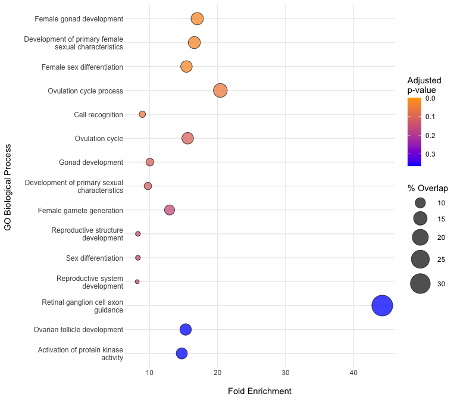
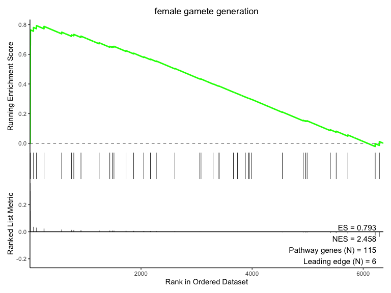
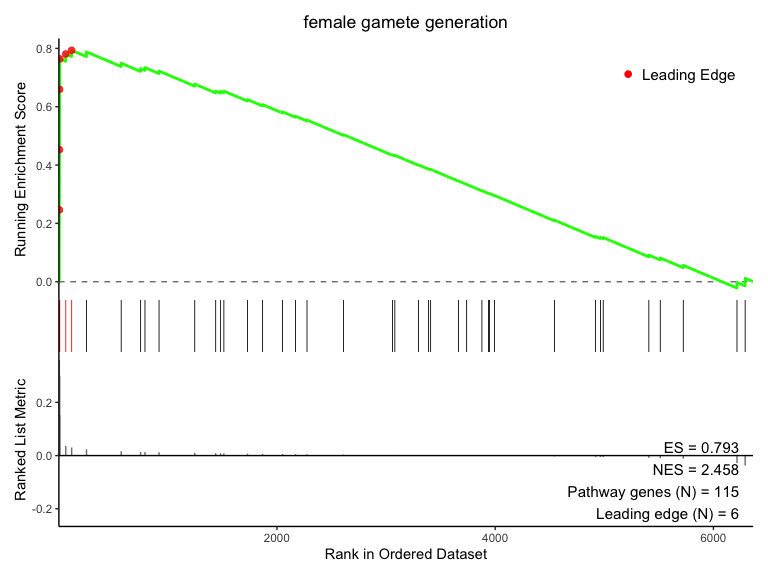

<!-- README.md is generated from README.Rmd. Please edit that file -->

# SomaEnrich

<!-- badges: start -->

<!-- badges: end -->

*This R package is an in-development resource and is research use only.*

## Overview

The `SomaEnrich` R package provides tools to perform pathway analysis
with proteomic data obtained from the SomaScan assay. The package also
provides auxiliary functions for manipulating, converting, and filtering
data prior to pathway analysis, as well as detailed documentation
describing the unique steps required to perform these operations with
proteomic data (as opposed to genomic data).

For more information about SomaScan data files (i.e. the ADAT, or
`.adat` file) and their format, please see the
[SomaLogic-Data](https://github.com/SomaLogic/SomaLogic-Data) GitHub
repository.

If you run into any issues/problems with `SomaEnrich` or have questions
about SomaScan analysis that are not answered by this package, please
consult the [issues](https://github.com/SomaLogic/SomaEnrich/issues/)
page and submit an issue and/or feature request.

### Package Key Features

- **Overrepresentation Analysis (ORA)**: Identify pathways enriched in a
  set of differentially expressed proteins using hypergeometric testing
- **Gene Set Enrichment Analysis (GSEA)**: Perform preranked GSEA to
  detect coordinated changes in predefined gene sets
- **SomaScan Identifier Handling**: Conversion between common gene
  identifiers and SomaScan-specific `AptNames`
- **Visualization Tools**: Plots to visualize the results of ORA and
  GSEA

------------------------------------------------------------------------

## Installation

*Note: SomaEnrich was developed and tested on macOS and Linux operating*
*systems. Users running Windows may encounter unexpected behavior or
errors.*

`SomaEnrich` requires that the user have R \>= 4.4.0 installed on their
system.

To install and load `SomaEnrich` from this repository, please run the
following:

``` r
remotes::install_github("SomaLogic/SomaEnrich")
```

Once installed, the package can be loaded using the usual syntax:

``` r
library(SomaEnrich)
```

## Package Dependencies

Below are the package dependencies for `SomaEnrich` (see also the
DESCRIPTION file):

- [SomaDataIO](https://CRAN.R-project.org/package=SomaDataIO) - install
  from CRAN: `install.packages("SomaDataIO")`
- [fgsea](https://bioconductor.org/packages/release/bioc/html/fgsea.html) -
  install from Bioconductor: `BiocManager::install("fgsea")`
- [ggplot2](https://CRAN.R-project.org/package=ggplot2) - install from
  CRAN: `install.packages("ggplot2")`
- [patchwork](https://CRAN.R-project.org/package=patchwork) - install
  from CRAN: `install.packages("patchwork")`
- [rlang](https://CRAN.R-project.org/package=rlang) - install from CRAN:
  `install.packages("rlang")`
- [scales](https://CRAN.R-project.org/package=scales) - install from
  CRAN: `install.packages("scales")`
- [stringr](https://CRAN.R-project.org/package=stringr) - install from
  CRAN: `install.packages("stringr")`
- [tidyr](https://CRAN.R-project.org/package=tidyr) - install from CRAN:
  `install.packages("tidyr")`
- [withr](https://CRAN.R-project.org/package=withr) - install from CRAN:
  `install.packages("withr")`

The GSEA and ORA functions in this package use the respective algorithms
from `fgsea`, under the hood. Please see the `fgsea` documentation for
more information.

------------------------------------------------------------------------

## Quick Start

### Identifier Conversion

Convert SomaScan analytes to genes:

``` r
head(ex_apt_pathway)
#> [1] "seq.9843.5"   "seq.3174.2"   "seq.9057.19"  "seq.15627.83" "seq.2867.52" 
#> [6] "seq.9835.16"

apt2gene(head(ex_apt_pathway))
#> [1] "ACTN1"   "ADAMTS1" "ADRM1"   "AKT1"    "AKT1"    "ALDH1A3"
```

Convert genes to SomaScan analytes:

``` r
genes <- withr::with_seed(123, sample(ex_gene_pathway, 5))

gene2apt(genes) # Returns NA if no analyte is found
#> [1] "seq.15447.45" "seq.21577.35" "seq.22128.8"  NA             "seq.12563.2"
```

Convert a GO term from genes to SomaScan analytes:

``` r
go2apt("GO:0022602")
#>  [1] "seq.10366.11" "seq.10550.37" "seq.12077.32" "seq.12444.39" "seq.13738.8" 
#>  [6] "seq.14056.4"  "seq.14583.49" "seq.14634.13" "seq.18814.21" "seq.18930.28"
#> [11] "seq.18931.40" "seq.19622.7"  "seq.20430.8"  "seq.21899.36" "seq.22578.17"
#> [16] "seq.2575.5"   "seq.25954.3"  "seq.2748.3"   "seq.2765.4"   "seq.2953.31" 
#> [21] "seq.3032.11"  "seq.3046.31"  "seq.3067.67"  "seq.3520.58"  "seq.3521.16" 
#> [26] "seq.3593.72"  "seq.4156.74"  "seq.4160.49"  "seq.4383.97"  "seq.4904.7"  
#> [31] "seq.4914.10"  "seq.4923.79"  "seq.4956.2"   "seq.5036.50"  "seq.5107.7"  
#> [36] "seq.5116.62"  "seq.6425.87"  "seq.8036.75"  "seq.8467.9"   "seq.8484.24"
```

### Overrepresentation Analysis (ORA)

Identify pathways represented in a set of differentially expressed
proteins:

``` r
# Get top differentially expressed genes from a pre-sorted results table
deg <- head(t_tests$EntrezGeneSymbol, 50)
uni <- t_tests$EntrezGeneSymbol

# Run ORA using GO Biological Process (the default)
ora_res <- somaORA(features = deg, universe = uni)
head(ora_res)
#>   resource_code pathway_id                                              pathway
#> 1            bp GO:0008585                             female gonad development
#> 2            bp GO:0046545 development of primary female sexual characteristics
#> 3            bp GO:0046660                           female sex differentiation
#> 4            bp GO:0022602                              ovulation cycle process
#> 5            bp GO:0008037                                     cell recognition
#> 6            bp GO:0042698                                      ovulation cycle
#>           pval       padj foldEnrichment overlap size
#> 1 9.367678e-06 0.03093025      16.997863       5   39
#> 2 1.064565e-05 0.03093025      16.572917       5   40
#> 3 1.531200e-05 0.03093025      15.416667       5   43
#> 4 3.771120e-05 0.05713247      20.397436       4   26
#> 5 4.834273e-05 0.05859138       8.938202       6   89
#> 6 1.119160e-04 0.10809292      15.598039       4   34
#>                               overlapFeatures
#> 1                  CGA, FSHB, LEP, LHB, ROBO2
#> 2                  CGA, FSHB, LEP, LHB, ROBO2
#> 3                  CGA, FSHB, LEP, LHB, ROBO2
#> 4                       CGA, FSHB, LEP, ROBO2
#> 5 LGALS3, ROBO2, CNTNAP2, FETUB, NTM, COLEC12
#> 6                       CGA, FSHB, LEP, ROBO2
```

``` r
# Visualize the ORA results
plotBubble(ora_res, n_pathways = 15)
```



### Gene Set Enrichment Analysis (GSEA)

Pre-ranked GSEA can be performed using the following workflow:

    prepareRanks() --> somaPrGSEA() --> plotES()

#### Preparing Ranked Input

Resolve many-to-one analyte-gene mappings and split heterodimers to
create a clean, unique ranking vector suitable for GSEA:

``` r
unique_ranks <- prepareRanks(stats = t_tests$log2_fc,
                             features = t_tests$EntrezGeneSymbol,
                             resolve_multimapping = TRUE,
                             resolve_method = "abs")

head(unique_ranks)
#>        PZP        CGA       FSHB      ENPP2        LHB       CGB3 
#> 0.43998712 0.35889179 0.35889179 0.05463412 0.21663722 0.29986665
```

#### Running GSEA

Perform preranked GSEA to detect coordinated pathway changes:

``` r
# Use GO Biological Process (the default)
gsea_res <- somaPrGSEA(ranks = unique_ranks)
#> Warning in prepareStats(stats, scoreType, gseaParam): There are ties in the preranked stats (0.49% of the list).
#> The order of those tied genes will be arbitrary, which may produce unexpected results.
```

``` r
# Visualize the enrichment score for a chosen pathway
plotES("female gamete generation", gsea_results = gsea_res)
```



``` r

# Add leading edge points to plot
plotES("female gamete generation", gsea_results = gsea_res, show_leading_edge = TRUE)
```



------------------------------------------------------------------------

## Package Data Objects

`SomaEnrich` comes bundled with data objects for use in examples and
vignettes:

| Object | Description |
|----|----|
| `example_data_11k` | A `soma_adat` containing example 11K SomaScan data |
| `t_tests` | Results of a two-group comparison of the Sex variable to identify genes differentially expressed in males vs. females |
| `pathway_map` | Mapping of genes to pathways from GO and MSigDB |
| `ex_gene_pathway` | Example pathway comprised of gene identifiers |
| `ex_apt_pathway` | Example pathway comprised of SomaScan `AptNames` |

The GO and MSigDB data in `pathway_map` is made available under the
terms of the [CC BY 4.0
license](https://creativecommons.org/licenses/by/4.0/). See
`?pathway_map` for more details.

------------------------------------------------------------------------

## MIT LICENSE

`SomaEnrich` is licensed under the MIT license and is intended solely
for research use only (RUO) purposes. The code contained herein may not
be used for diagnostic, clinical, therapeutic, or other commercial
purposes.

- See:
  - [LICENSE](https://github.com/SomaLogic/SomaEnrich/blob/main/LICENSE.md)
- The MIT license:
  - <https://choosealicense.com/licenses/mit/>
  - [https://www.tldrlegal.com/license/mit-license/](https://www.tldrlegal.com/license/mit-license)
- Further:
  - “SomaEnrich” and “SomaLogic” are trademarks owned by Illumina,
    Inc. No license is hereby granted to these trademarks other than for
    purposes of identifying the origin or source of this Software.
