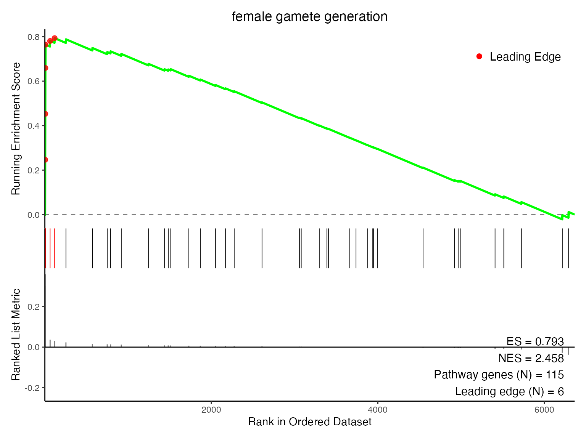
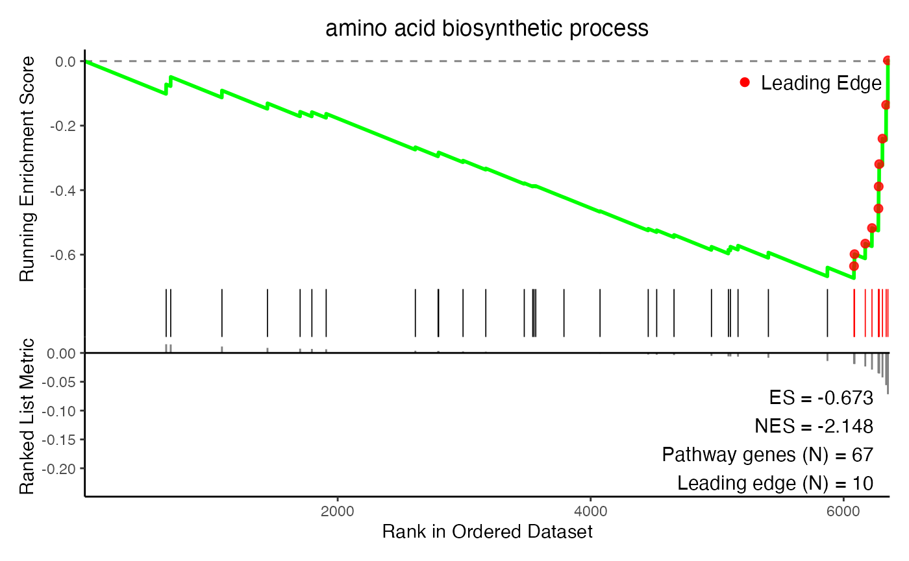
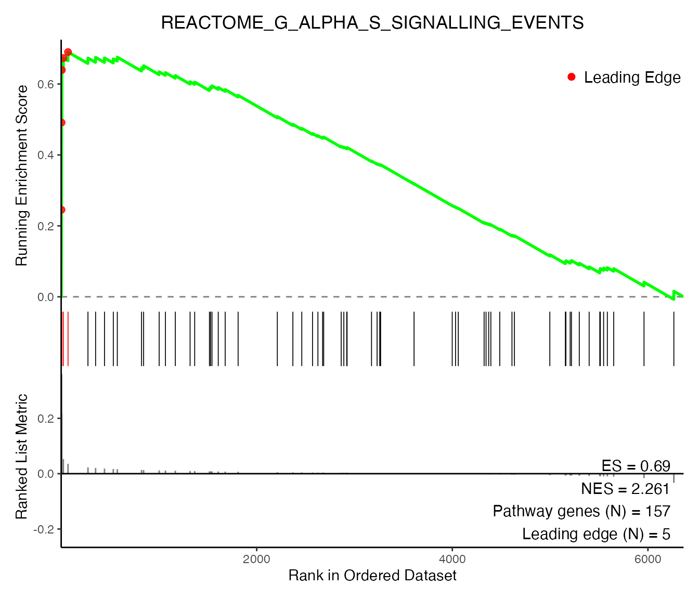

# Introduction to SomaEnrich

*This R package is an in-development resource and is research use only.*

------------------------------------------------------------------------

The `SomaEnrich` R package provides tools to perform standard pathway
enrichment analyses, like over-representation analysis (ORA) and gene
set enrichment analysis (GSEA), with SOMAmer^(®) Reagent-based SomaScan
data.

Why create this tool when there are so many pre-existing pathway
analysis resources? The currently available ecosystem of software and R
packages were often designed for (and derived from) transcriptomic data,
and may not be as readily compatible with SomaScan data. SomaScan is a
proteomics technology, and the SomaScan data file (`.adat`) is centered
around SomaScan assay analytes (SOMAmer Reagents). This means that
SomaScan measurements are representative of SOMAmer Reagent *protein*
targets, rather than transcribed genes, as they would in transcriptomic
data.

The tools in this package account for SomaScan-specific analysis
complexities that stem from this key difference in technologies.

------------------------------------------------------------------------

## Main Features

The functions in this package can be divided into a few categories:

- Identifier mapping utilities
  - map SomaScan analytes to gene identifiers, and vice versa
    ([`apt2gene()`](https://somalogic.github.io/SomaEnrich/reference/apt2gene.md)
    &
    [`gene2apt()`](https://somalogic.github.io/SomaEnrich/reference/gene2apt.md))
  - convert entire pathways of genes to SomaScan identifiers
    ([`genePath2aptPath()`](https://somalogic.github.io/SomaEnrich/reference/genePath2aptPath.md)
    and
    [`aptPath2genePath()`](https://somalogic.github.io/SomaEnrich/reference/aptPath2genePath.md))
- Data wrangling resources
  - convert an `AptName`-centric `data.frame` into a gene-centric
    `data.frame`
    ([`collapseAptData()`](https://somalogic.github.io/SomaEnrich/reference/collapseAptData.md))
  - convert a data frame into a list of vectors, with one list element
    per unique group
    ([`df2list()`](https://somalogic.github.io/SomaEnrich/reference/df2list.md))
- Enrichment analysis
  - prepare SomaScan statistical data for gene-based enrichment analysis
    ([`prepareRanks()`](https://somalogic.github.io/SomaEnrich/reference/prepareRanks.md))
  - perform pre-ranked gene set enrichment analysis (GSEA) using the
    `fgsea` algorithm
    ([`somaPrGSEA()`](https://somalogic.github.io/SomaEnrich/reference/somaPrGSEA.md))
  - perform over-representation analysis (ORA) using a hypergeometric
    test
    ([`somaORA()`](https://somalogic.github.io/SomaEnrich/reference/somaORA.md))
- Data visualization tools
  - create an enrichment plot from a GSEA results table
    ([`plotES()`](https://somalogic.github.io/SomaEnrich/reference/plotES.md))
  - create a bubble plot from an ORA results table
    ([`plotBubble()`](https://somalogic.github.io/SomaEnrich/reference/plotBubble.md))

Below is a basic walkthrough illustrating how SomaEnrich functions can
be used to perform pre-ranked GSEA, using differential expression
results from SomaScan assay data.

#### A Note on ORA vs. GSEA

Both ORA and GSEA are widely used approaches for pathway enrichment, and
both are supported by SomaEnrich. In general:

- ORA tests whether a pre-selected set of features (e.g. differentially
  expressed analytes above some significance or fold-change threshold)
  overlaps with known pathways more than would be expected by chance.
  The process is relatively straightforward: define a threshold,
  identify features that pass it, and run a hypergeometric test.
  However, ORA requires an arbitrary cutoff to define the feature list.
  Because of this requirement, ORA can be sensitive to the choice of
  threshold.

- GSEA (in this case, pre-ranked) operates on a ranked list of *all*
  measured features, without applying a significance cutoff. Pre-ranked
  GSEA evaluates whether the members of a given gene set tend to cluster
  toward the top or bottom of a ranked list.

This vignette primarily focuses on GSEA because it requires more
considerations and pre-processing steps for SomaScan specifically.
Please reference
[`?somaORA`](https://somalogic.github.io/SomaEnrich/reference/somaORA.md)
for examples of performing ORA with SomaScan-derived differential
expression data.

------------------------------------------------------------------------

## Example Workflow

### Getting Started

First, we need to load the R packages required for this vignette:

``` r

library(dplyr)
library(fgsea)
library(limma)
library(SomaDataIO)
```

A requirement of pre-ranked GSEA is a numeric vector of statistical
results that can be used to rank genes. This workflow assumes that some
ranking procedure, like differential expression analysis, has already
been performed using data from a pre-processed SomaScan ADAT. Example
ADATs can be obtained from the
[SomaLogic-Data](https://github.com/SomaLogic/SomaLogic-Data) GitHub
repository.

For more information about pre-processing your ADAT, please see the
[SomaDataIO Pre-Processing
article](https://somalogic.github.io/SomaDataIO/articles/pre-processing.html).

For an example differential expression workflow (via t-test), please see
the [SomaDataIO Two-Group Comparison
workflow](https://somalogic.github.io/SomaDataIO/articles/stat-two-group-comparison.html).

A differential expression results data set, called `t_tests`, is
available as a data object in `SomaEnrich`. The `t_tests` data set will
be used as the starting point for this analysis. `t_tests` was created
by comparing two groups, males and females, using the `Sex` variable
from the
[`SomaEnrich::example_data_11k`](https://somalogic.github.io/SomaEnrich/reference/example_data_11k.md)
ADAT. See
[`?t_tests`](https://somalogic.github.io/SomaEnrich/reference/t_tests.md)
for more information.

``` r

head(t_tests, n = 10)
#> # A tibble: 10 × 12
#>    AptName      SeqId Target EntrezGeneSymbol UniProt formula   t_test 
#>    <chr>        <chr> <chr>  <chr>            <chr>   <list>    <list> 
#>  1 seq.8468.19  8468… PSA    KLK3             P07288  <formula> <htest>
#>  2 seq.6580.29  6580… Pregn… PZP              P20742  <formula> <htest>
#>  3 seq.21232.39 2123… BPSA   KLK3             P07288  <formula> <htest>
#>  4 seq.7926.13  7926… SPIT3  SPINT3           P49223  <formula> <htest>
#>  5 seq.13699.6  1369… PSA    KLK3             P07288  <formula> <htest>
#>  6 seq.4330.4   4330… PSA    KLK3             P07288  <formula> <htest>
#>  7 seq.3032.11  3032… FSH    CGA|FSHB         P01215… <formula> <htest>
#>  8 seq.16892.23 1689… ENPP2  ENPP2            Q13822  <formula> <htest>
#>  9 seq.2953.31  2953… Lutei… CGA|LHB          P01215… <formula> <htest>
#> 10 seq.5763.67  5763… HBD-4  DEFB104A         Q8WTQ1  <formula> <htest>
#> # ℹ 5 more variables: t_stat <dbl>, p.value <dbl>, fdr <dbl>,
#> #   fc <dbl>, log2_fc <dbl>
```

Because `Sex` was used to compare these groups, a number of
sex-associated proteins are seen at the top of the t-test results, when
sorted by `|t_stat|`.

### Selecting Ranking Metrics

SomaEnrich performs GSEA via the
[`somaPrGSEA()`](https://somalogic.github.io/SomaEnrich/reference/somaPrGSEA.md)
function, which uses the algorithm from the
[fgsea](https://bioconductor.org/packages/release/bioc/html/fgsea.html)
R package under the hood. Like fgsea,
[`SomaEnrich::somaPrGSEA()`](https://somalogic.github.io/SomaEnrich/reference/somaPrGSEA.md)
requires an input statistic to rank the features.

Any numeric statistic can be used as a ranking metric, including test
statistics, measures of significance (-log10(p-value)), or
signed/unsigned metrics measuring association of phenotype to analyte
(fold change or log2 fold change). However, because the statistic will
be sorted in descending order during calculation of the enrichment
score, metrics in which higher values = stronger signal are often used.
The best ranking metric depends on your data, experiment, and/or
analysis question. See [GSEA metrics for ranking
genes](https://docs.gsea-msigdb.org/#GSEA/GSEA_User_Guide/#metrics-for-ranking-genes)
for more details.

For the purposes of this vignette, we will use the log2_fc as a ranking
variable. Please note that this may not be the best metric for your
experiment, and is merely used here as an example.

We can create the GSEA input rank vector from the `t_tests` object,
using the log2_fc column with values calculated for each analyte:

``` r

rank_vec <- t_tests$log2_fc

names(rank_vec) <- t_tests$EntrezGeneSymbol

rank_vec[1:10]
#>        KLK3         PZP        KLK3      SPINT3        KLK3 
#> -0.18770145  0.43998712 -0.27856055 -0.13429816 -0.21372635 
#>        KLK3    CGA|FSHB       ENPP2     CGA|LHB    DEFB104A 
#> -0.13184144  0.35889179  0.05463412  0.21663722 -0.11179134
```

Gene symbols/identifiers *or* SomaScan `AptNames` may be used as names
for the ranking statistic vector. However, additional steps may be
required when using `AptNames`, and these will be described in a later
section of this vignette.

### Resolving Non-1:1 Relationships

You may have noticed that the names of the `rank_vec` object above
contain duplicate values; for example, KLK3 (Kallikrein-related
peptidase 3) is represented more than once in the first 10 elements of
the vector, and CGA (glycoprotein hormones alpha polypeptide) is
represented multiple times in different “\|”-delineated strings. If you
are accustomed to working with gene-level data, this duplication may
seem strange. These are instances of non-1:1 mapping (i.e. one
identifier maps to \>1 values) between SOMAmer Reagents (with `SeqId`
identifiers) and canonical protein or gene target identifiers.

There are a variety of reasons why these entities may not have a 1:1
relationship. In some instances, a SOMAmer Reagent binds a heterodimer
protein (or larger heterocomplex), where protein subunits originate from
different genes. In other cases, multiple SOMAmer Reagents were
developed for the same protein target, or multiple proteoforms have a
common gene product identifier.

Take KLK3 as an example:

``` r

filter(t_tests, EntrezGeneSymbol == "KLK3") |>
  dplyr::select(AptName:UniProt, log2_fc)
#> # A tibble: 4 × 6
#>   AptName      SeqId    Target EntrezGeneSymbol UniProt log2_fc
#>   <chr>        <chr>    <chr>  <chr>            <chr>     <dbl>
#> 1 seq.8468.19  8468-19  PSA    KLK3             P07288   -0.188
#> 2 seq.21232.39 21232-39 BPSA   KLK3             P07288   -0.279
#> 3 seq.13699.6  13699-6  PSA    KLK3             P07288   -0.214
#> 4 seq.4330.4   4330-4   PSA    KLK3             P07288   -0.132
```

Multiple SOMAmer Reagents were developed for the KLK3 protein target, as
seen in the table above for KLK3. All SOMAmer Reagents have a unique
SomaScan-specific identifier (`SeqId`), but in this case multiple
reagents possess the same gene and protein identifiers. This means that,
if we were only to use the “EntrezGeneSymbol” and “log2_fc” information
to make a named input vector to GSEA, we would see duplicate gene names
in the vector.

The GSEA algorithm requires that the input ranking vector be comprised
of only **unique** values. This necessitates an extra pre-processing
step to resolve the duplication described here.

Many functions in SomaEnrich select only **one** assay analyte to
represent each gene in enrichment analyses. The ideal method to select
this analyte can vary, depending on the ranking metric used; by default,
the analyte with the largest \|log2_fc\| would be selected. This ensures
that the measurement from the analyte with the greatest association to
the biological feature of interest is retained.

This processing step is handled by the
[`prepareRanks()`](https://somalogic.github.io/SomaEnrich/reference/prepareRanks.md)
function, which is also called under the hood by
[`somaPrGSEA()`](https://somalogic.github.io/SomaEnrich/reference/somaPrGSEA.md).
This important step allows proteomic SomaScan data to be adapted for
gene-based analysis workflows. For more information about this
procedure, and for more detailed descriptions of these non-1:1
relationships, please reference the other package vignette via
`browseVignettes("SomaEnrich")`.

With
[`prepareRanks()`](https://somalogic.github.io/SomaEnrich/reference/prepareRanks.md),
we can create a unique statistical vector that is suitable for input to
GSEA:

``` r

prepped_ranks <- prepareRanks(stats     = t_tests$log2_fc,
                              features  = t_tests$EntrezGeneSymbol,
                              split_ids = TRUE,            # Default
                              resolve_multimapping = TRUE, # Default
                              resolve_method = "abs")      # Default

head(prepped_ranks, n = 10)
#>         PZP        KLK3      SPINT3         CGA        FSHB 
#>  0.43998712 -0.27856055 -0.13429816  0.35889179  0.35889179 
#>       ENPP2         LHB    DEFB104A      CRISP2        CGB3 
#>  0.05463412  0.21663722 -0.11179134 -0.06999575  0.29986665

# Only 1 KLK3 value remaining
which(names(prepped_ranks) == "KLK3")
#> [1] 2

# No gene name duplications
any(grepl("\\|", names(prepped_ranks)))
#> [1] FALSE
```

Only one value is present for gene KLK3, and all heterodimers or
complexes have been split into their constituent parts. The
`prepped_ranks` vector is ready for pre-ranked GSEA.

As mentioned previously, this same function is called under the hood in
[`somaPrGSEA()`](https://somalogic.github.io/SomaEnrich/reference/somaPrGSEA.md),
but
[`prepareRanks()`](https://somalogic.github.io/SomaEnrich/reference/prepareRanks.md)
enables easy access to this processed ranking metric *without*
performing GSEA, and the output can be used for other gene-based
analyses.

### Running Pre-Ranked GSEA

To perform GSEA with SomaEnrich, the following inputs are required:

1.  A named vector of ranking statistics (`rank_vec`) with one
    measurement per gene
2.  Biological networks or gene sets to interrogate for enrichment

#### Selecting Gene Sets

The SomaEnrich package provides networks from both the Gene Ontology
(GO) and the Molecular Signatures Database (MSigDB). The default network
used in
[`somaPrGSEA()`](https://somalogic.github.io/SomaEnrich/reference/somaPrGSEA.md)
is GO Biological Process (BP). A full list of available networks and a
short description of each collection can be found via `?somaPrGSEA()`.

Please note that only *one* biological network can be selected. Mixing
networks and/or subcollections can inflate and distort the null
distribution, because the gene sets differ wildly in size, redundancy,
and biological intent (A. Subramanian 2005). Additionally, selecting
only one collection helps keep processing time down, while also avoiding
over-testing as a consequence of performing too many statistical tests
on large numbers of gene sets.

#### Putting it All Together

We will run pre-ranked GSEA with our log2_fc vector, using GO BP for
enrichment.

``` r

gsea_res <- somaPrGSEA(ranks = prepped_ranks,
                       resource = "bp")
#> Warning in prepareStats(stats, scoreType, gseaParam): There are ties in the preranked stats (0.49% of the list).
#> The order of those tied genes will be arbitrary, which may produce unexpected results.
```

A few messages will be produced when this function is run interactively:

- When `split_ids = TRUE` (the default), heterodimers are split into
  multiple values, one for each gene/protein in the complex, and this
  can create ties in the ranked input vector
- When `resolve_multimapping = TRUE` (the default), duplicate gene
  measurements will be filtered, selecting one value for retention (in
  cases of non-1:1 mapping) and other values will be dropped from the
  ranked input vector (Note: this may be outputted by
  [`prepareRanks()`](https://somalogic.github.io/SomaEnrich/reference/prepareRanks.md)
  in a previous step)

This ensures that the names of the `rank_vec` are unique, and that only
one measurement per gene is used for GSEA.

The output contains two objects:

- A `data.frame` object containing the results of GSEA, with one row per
  pathway
- A vector of the ranks used as input into GSEA, which may differ from
  the input ranks (reference
  [`prepareRanks()`](https://somalogic.github.io/SomaEnrich/reference/prepareRanks.md)
  for more details)

``` r

summary(gsea_res)
#>             Length Class      Mode   
#> results       11   data.frame list   
#> final_ranks 6364   -none-     numeric

head(gsea_res$final_ranks)
#>         PZP        KLK3      SPINT3         CGA        FSHB 
#>  0.43998712 -0.27856055 -0.13429816  0.35889179  0.35889179 
#>       ENPP2 
#>  0.05463412

gsea_res$results |>
  dplyr::select(-leadingEdge) |>
  head(n = 10)
#>    resource_code pathway_id
#> 1             bp GO:0046545
#> 2             bp GO:0007186
#> 3             bp GO:0042742
#> 4             bp GO:0019731
#> 5             bp GO:0007292
#> 6             bp GO:0042698
#> 7             bp GO:0008284
#> 8             bp GO:0001541
#> 9             bp GO:0022602
#> 10            bp GO:0008585
#>                                                 pathway         pval
#> 1  development of primary female sexual characteristics 1.586104e-05
#> 2          G protein-coupled receptor signaling pathway 2.225441e-05
#> 3                         defense response to bacterium 2.668031e-05
#> 4                        antibacterial humoral response 5.743648e-05
#> 5                              female gamete generation 9.640380e-05
#> 6                                       ovulation cycle 1.048600e-04
#> 7  positive regulation of cell population proliferation 1.078285e-04
#> 8                          ovarian follicle development 1.561967e-04
#> 9                               ovulation cycle process 1.585813e-04
#> 10                             female gonad development 1.976236e-04
#>          padj   log2err         ES       NES starting_set_size
#> 1  0.05389423 0.5756103  0.8001085  2.471181                60
#> 2  0.05389423 0.5756103  0.4941669  1.933540              1337
#> 3  0.05389423 0.5756103 -0.4208543 -1.762107               322
#> 4  0.08701627 0.5573322 -0.6261352 -2.119623                86
#> 5  0.09334868 0.5384341  0.7933356  2.458399               115
#> 6  0.09334868 0.5384341  0.8065727  2.416269                48
#> 7  0.09334868 0.5384341  0.4265924  1.719583               846
#> 8  0.10677810 0.5188481  0.8321372  2.343419                35
#> 9  0.10677810 0.5188481  0.8318502  2.342610                32
#> 10 0.11975989 0.5188481  0.8005251  2.455012                58
#>    final_set_size
#> 1              40
#> 2             318
#> 3             196
#> 4              52
#> 5              41
#> 6              34
#> 7             476
#> 8              26
#> 9              26
#> 10             39
```

Descriptions of what each column contains can be found via
`?somaPrGSEA()`. As expected, some of the top enriched pathways are
sex-related. Column descriptions for `pval`, `padj`, `ES`, and `NES` can
be found in `?somaPrGSEA()`.

Let’s take a closer look at the `leadingEdge` column, which was removed
from the preview above:

``` r

filter(gsea_res$results, pathway_id == "GO:0022602") |>
    pull(leadingEdge)
#> [[1]]
#> [1] "CGA"   "FSHB"  "LEP"   "ROBO2" "INHBA" "CASP3"
```

The values in `leadingEdge` are the leading edge genes, i.e. the core
subset of features that account for the observed enrichment signal in
that gene set (see the [original GSEA software
documentation](https://docs.gsea-msigdb.org/#GSEA/GSEA_User_Guide/#running-a-leading-edge-analysis)
for more details about leading edge analysis). So, in the example above,
the leading edge genes were found to be concentrated toward the top of
the `rank_vec` ranked list for the pathway <GO:0022602> (“ovulation
cycle process”).

Remember the sex-associated analytes in the `t_tests` data set that were
identified earlier in this vignette? Genes associated with these
analytes, like CGA and FSHB, were frequently identified as leading edge
genes.

``` r

# Add column indicating if the leading edge subset contain CGA/FSHB
gsea_res$results |>
    mutate(cga_fshb_le = grepl("CGA|FSHB", leadingEdge)) |>
    select(pathway, leadingEdge, cga_fshb_le) |>
    head(n = 10)
#>                                                 pathway
#> 1  development of primary female sexual characteristics
#> 2          G protein-coupled receptor signaling pathway
#> 3                         defense response to bacterium
#> 4                        antibacterial humoral response
#> 5                              female gamete generation
#> 6                                       ovulation cycle
#> 7  positive regulation of cell population proliferation
#> 8                          ovarian follicle development
#> 9                               ovulation cycle process
#> 10                             female gonad development
#>                                                                                                                                                                                                                                                                                                                                                                                                                                                                                                                                                                                                                                                                                                       leadingEdge
#> 1                                                                                                                                                                                                                                                                                                                                                                                                                                                                                                                                                                                                                                                                        CGA, FSHB, LHB, LEP, ROBO2, INHBA, CASP3
#> 2                                                                                                                                                                                                                                                       CGA, FSHB, CGB3, CGB7, LHB, C3, NPPB, GCG, APLP1, CXCL11, PLA2G2A, HOMER2, IAPP, ITGB3, JAK2, TREM2, NTS, SCG5, GHRL, CCL14, SPHK1, NMB, ROCK2, CCL22, ADGRB1, WNK1, OXSR1, TM2D1, PTH, PPP1R9B, PENK, STAT5A, ROBO1, GIPC1, GAP43, CXCL10, AKT1, NMT2, AGT, PDGFRB, CX3CL1, GIP, AHCYL1, EDN2, KLK5, NMT1, AREG, PRKAR1B, SST, CXCL17, SCT, CXCL13, SNCA, LTB4R, CXCL12, RGS18, PROK2, PPP3CA, KISS1, PTPN6, CXCL1, CCL15, PRKCA, F2, ECE1, NPPA, SORCS1
#> 3                                                                                                                                                                                                                                                                                                                                                                                               KLK3, DEFB104A, IGHD, DEFB4A, HAMP, LACRT, IGHE, ANG, BPI, PI3, H2BC21, RPL30, S100A9, CAMP, H2BC12, DEFA1, DEFA3, TREM1, STATH, PGLYRP1, LCN2, ARG2, FGR, PGLYRP3, HAVCR2, ADAM17, MICA, CHGA, SERPINE1, TAC1, RNASE3, MAP3K7, CFP, SELP, IL18R1, KLK7, HLA-E, REG3G, IGHA2, IGHA1, HTN1, DEFB136, SFTPD, S100A8
#> 4                                                                                                                                                                                                                                                                                                                                                                                                                                                                                                                                                                                                                                             KLK3, IGHD, IGHE, ANG, BPI, PI3, H2BC21, CAMP, H2BC12, DEFA1, DEFA3
#> 5                                                                                                                                                                                                                                                                                                                                                                                                                                                                                                                                                                                                                                                                               FSHB, CGB3, CGB7, LEP, IL12B, PTN
#> 6                                                                                                                                                                                                                                                                                                                                                                                                                                                                                                                                                                                                                                                                        CGA, FSHB, LEP, PTN, ROBO2, INHBA, CASP3
#> 7  FCGR3A, CGA, FSHB, LEP, FOXJ2, IGF2, FGF19, FER, IL12B, ITGAV, ITGB3, LTA, PTN, JAK2, AGER, FOLR2, TNFAIP3, GHRL, EMC10, CCL14, REG1B, SPHK1, XBP1, CSF1R, NMB, KDM4C, FGF16, PDPK1, GDF2, FGF6, TIRAP, CD28, CTNNB1, CD80, PIK3CA, PIK3R1, FN1, STAT5A, GAS6, PDCL3, IGFBP2, TGM1, CXCL10, AKT1, CD40LG, MMP12, AGT, PDGFRB, CX3CL1, CXCL5, REG3A, FBLN1, EPHB2, EDN2, IL23A, MYC, FCRL3, FGFR4, AREG, HCLS1, AGGF1, JAML, IL12RB1, PDGFD, PRDX3, NRG1, THBS4, GREM1, FGF7, NTF3, IL2RB, CXCL12, LAMC2, GFAP, HTN3, PPP3CA, PTPN6, ERBB3, PRKCA, CNTFR, IFNG, NLGN2, IGF1, LILRB2, CSF2RB, VEGFA, VIP, IL11RA, DHX9, FLNA, SMARCC1, CD209, XCL1, IL7, SIRPG, LEPR, IL6R, GRN, PTEN, TNFSF9, IL10RA, SHH, FZD9
#> 8                                                                                                                                                                                                                                                                                                                                                                                                                                                                                                                                                                                                                                                                                                  CGA, FSHB, LHB
#> 9                                                                                                                                                                                                                                                                                                                                                                                                                                                                                                                                                                                                                                                                             CGA, FSHB, LEP, ROBO2, INHBA, CASP3
#> 10                                                                                                                                                                                                                                                                                                                                                                                                                                                                                                                                                                                                                                                                       CGA, FSHB, LHB, LEP, ROBO2, INHBA, CASP3
#>    cga_fshb_le
#> 1         TRUE
#> 2         TRUE
#> 3        FALSE
#> 4        FALSE
#> 5         TRUE
#> 6         TRUE
#> 7         TRUE
#> 8         TRUE
#> 9         TRUE
#> 10        TRUE
```

These sex-associated genes drive a large portion of the enrichment
identified in each of these gene sets.

Next, let’s look at the set size columns:

``` r

select(gsea_res$results, pathway, contains("size")) |>
    head()
#>                                                pathway
#> 1 development of primary female sexual characteristics
#> 2         G protein-coupled receptor signaling pathway
#> 3                        defense response to bacterium
#> 4                       antibacterial humoral response
#> 5                             female gamete generation
#> 6                                      ovulation cycle
#>   starting_set_size final_set_size
#> 1                60             40
#> 2              1337            318
#> 3               322            196
#> 4                86             52
#> 5               115             41
#> 6                48             34
```

These columns illustrate how many genes in each gene set were filtered
from the set, *prior* to running GSEA. This is a standard pre-processing
step for GSEA; genes present in each gene set that are not found in the
`ranks` vector are removed prior to enrichment. This can have a small or
large impact on the set size, depending on the content of the set.

#### AptNames Instead of Gene IDs

As mentioned in the previous section, GSEA can be run using SomaScan
`AptNames` rather than gene IDs, if desired. To do so, the vector
provided to `ranks` must be named with `AptNames`:

``` r

apt_vec <- t_tests$log2_fc
names(apt_vec) <- t_tests$AptName

head(apt_vec)
#>  seq.8468.19  seq.6580.29 seq.21232.39  seq.7926.13  seq.13699.6 
#>   -0.1877014    0.4399871   -0.2785606   -0.1342982   -0.2137264 
#>   seq.4330.4 
#>   -0.1318414
```

Note that `SeqIds` are *not* accepted as vector names - the R-compatible
`AptName` format (`seq.1234.56`) must be used. If starting from
`SeqIds`, the
[`SomaDataIO::seqid2apt()`](https://somalogic.github.io/SomaDataIO/reference/SeqId.html)
function can be used to convert between the two formats. See
`?SomaDataIO::seqid2apt()` for more details.

Additionally, the column metadata from a `soma_adat` object will be
required as input. The information in the metadata will be used to map
genes from GO and MSigDB to SomaScan assay identifiers .

The column metadata can be extracted from a `soma_adat` using
[`SomaDataIO::getAnalyteInfo()`](https://somalogic.github.io/SomaDataIO/reference/getAnalyteInfo.html):

``` r

col_meta <- SomaDataIO::getAnalyteInfo(example_data_11k)

head(col_meta)
#> # A tibble: 6 × 26
#>   AptName      SeqId  SeqIdVersion SomaId TargetFullName Target UniProt
#>   <chr>        <chr>         <dbl> <chr>  <chr>          <chr>  <chr>  
#> 1 seq.10000.28 10000…            3 SL019… Beta-crystall… CRBB2  P43320 
#> 2 seq.10001.7  10001…            3 SL002… RAF proto-onc… c-Raf  P04049 
#> 3 seq.10003.15 10003…            3 SL019… Zinc finger p… ZNF41  P51814 
#> 4 seq.10006.25 10006…            3 SL019… ETS domain-co… ELK1   P19419 
#> 5 seq.10008.43 10008…            3 SL019… Guanylyl cycl… GUC1A  P43080 
#> 6 seq.10010.10 10010…            3 SL014… Beclin-1       BECN1  Q14457 
#> # ℹ 19 more variables: EntrezGeneID <chr>, EntrezGeneSymbol <chr>,
#> #   Organism <chr>, Units <chr>, Type <chr>, Dilution <chr>,
#> #   PlateScale_Reference <dbl>, CalReference <dbl>,
#> #   Cal_SS.000005_Set001 <dbl>, ColCheck <chr>,
#> #   CalQcRatio_SS.000005_Set001_200170 <dbl>,
#> #   QcReference_200170 <dbl>, Cal_SS.000005_Set002 <dbl>,
#> #   CalQcRatio_SS.000005_Set002_200170 <dbl>, …
```

When running
[`somaPrGSEA()`](https://somalogic.github.io/SomaEnrich/reference/somaPrGSEA.md)
with `AptNames`, is it important to set `use_aptnames = TRUE` *and*
provide a data frame of column meta data to `col_meta_df`. This will
produce a progress bar that tracks the conversion of GO BP terms from
their original gene identifiers to SomaScan `AptNames`, so gene set
enrichment can be performed in aptamer space (i.e. using `AptNames` in
the ranking vector and `AptName`-containing pathways).

Once all gene sets have been converted to `AptNames`, GSEA will be
performed using the ranked `AptNames`.

``` r

gsea_res_apt <- somaPrGSEA(ranks        = apt_vec,
                           col_meta_df  = col_meta, # Required
                           use_aptnames = TRUE)     # Required)
#> Warning in prepareStats(stats, scoreType, gseaParam): There are ties in the preranked stats (0.03% of the list).
#> The order of those tied genes will be arbitrary, which may produce unexpected results.

gsea_res_apt$results |>
    dplyr::select(resource_code:NES) |>
    slice_head(n = 20)
#>    resource_code pathway_id
#> 1             bp GO:0019731
#> 2             bp GO:0002784
#> 3             bp GO:0002225
#> 4             bp GO:0016485
#> 5             bp GO:0042742
#> 6             bp GO:0031638
#> 7             bp GO:0002760
#> 8             bp GO:0002786
#> 9             bp GO:0002759
#> 10            bp GO:0002775
#> 11            bp GO:0002778
#> 12            bp GO:0042699
#> 13            bp GO:0008585
#> 14            bp GO:1900426
#> 15            bp GO:0019216
#> 16            bp GO:0019730
#> 17            bp GO:0046545
#> 18            bp GO:0009617
#> 19            bp GO:0003073
#> 20            bp GO:0046660
#>                                                    pathway
#> 1                           antibacterial humoral response
#> 2           regulation of antimicrobial peptide production
#> 3  positive regulation of antimicrobial peptide production
#> 4                                       protein processing
#> 5                            defense response to bacterium
#> 6                                       zymogen activation
#> 7    positive regulation of antimicrobial humoral response
#> 8           regulation of antibacterial peptide production
#> 9             regulation of antimicrobial humoral response
#> 10                        antimicrobial peptide production
#> 11                        antibacterial peptide production
#> 12          follicle-stimulating hormone signaling pathway
#> 13                                female gonad development
#> 14    positive regulation of defense response to bacterium
#> 15                   regulation of lipid metabolic process
#> 16                          antimicrobial humoral response
#> 17    development of primary female sexual characteristics
#> 18                                   response to bacterium
#> 19          regulation of systemic arterial blood pressure
#> 20                              female sex differentiation
#>            pval         padj   log2err         ES       NES
#> 1  1.052977e-08 2.947945e-05 0.7477397 -0.7349885 -2.603962
#> 2  1.460882e-08 2.947945e-05 0.7477397 -0.9673343 -2.254307
#> 3  1.802601e-08 2.947945e-05 0.7337620 -0.9757868 -2.221697
#> 4  2.029998e-08 2.947945e-05 0.7337620 -0.5345372 -2.195509
#> 5  2.210185e-08 2.947945e-05 0.7337620 -0.4734141 -2.015667
#> 6  7.483225e-08 8.317604e-05 0.7049757 -0.7286306 -2.520386
#> 7  1.110022e-07 1.011280e-04 0.7049757 -0.9468849 -2.267047
#> 8  1.213111e-07 1.011280e-04 0.6901325 -0.9909897 -1.925841
#> 9  1.199175e-06 8.885889e-04 0.6435518 -0.9389019 -2.280747
#> 10 8.405233e-06 5.293281e-03 0.5933255 -0.9205340 -2.363617
#> 11 9.524573e-06 5.293281e-03 0.5933255 -0.9419308 -2.144613
#> 12 9.257055e-06 5.293281e-03 0.5933255  0.9856602  1.940181
#> 13 1.370089e-05 6.792679e-03 0.5933255  0.7702390  2.415807
#> 14 1.629672e-05 6.792679e-03 0.5756103 -0.9251532 -2.156007
#> 15 1.565678e-05 6.792679e-03 0.5756103  0.5583672  2.049592
#> 16 1.454155e-05 6.792679e-03 0.5933255 -0.4610553 -1.896939
#> 17 2.299590e-05 8.592634e-03 0.5756103  0.7699026  2.425375
#> 18 2.319200e-05 8.592634e-03 0.5756103 -0.3465975 -1.577471
#> 19 2.635056e-05 9.249047e-03 0.5756103 -0.6803609 -2.295483
#> 20 3.464807e-05 1.155340e-02 0.5573322  0.7565999  2.410970
```

Because GSEA was performed in aptamer space, the `leadingEdge` column
contains leading edge **analytes**, rather than genes.

``` r

gsea_res_apt$results |>
    pull(leadingEdge) |>
    head(n = 5)
#> [[1]]
#>  [1] "seq.21232.39" "seq.13699.6"  "seq.8468.19"  "seq.4330.4"  
#>  [5] "seq.4916.2"   "seq.4135.84"  "seq.4874.3"   "seq.4126.22" 
#>  [9] "seq.4982.54"  "seq.22974.25" "seq.9384.17"  "seq.22403.13"
#> [13] "seq.9250.87"  "seq.14143.8"  "seq.20539.4"  "seq.15481.45"
#> 
#> [[2]]
#> [1] "seq.21232.39" "seq.13699.6"  "seq.8468.19"  "seq.4330.4"  
#> 
#> [[3]]
#> [1] "seq.21232.39" "seq.13699.6"  "seq.8468.19"  "seq.4330.4"  
#> 
#> [[4]]
#>  [1] "seq.21232.39"  "seq.13699.6"   "seq.8468.19"   "seq.4330.4"   
#>  [5] "seq.3396.54"   "seq.25446.34"  "seq.18864.7"   "seq.5015.15"  
#>  [9] "seq.2212.69"   "seq.14273.19"  "seq.7994.41"   "seq.8465.52"  
#> [13] "seq.3348.49"   "seq.10895.28"  "seq.6368.9"    "seq.19251.56" 
#> [17] "seq.8882.1"    "seq.14123.34"  "seq.3474.19"   "seq.4931.59"  
#> [21] "seq.4534.10"   "seq.21387.64"  "seq.21436.56"  "seq.15513.108"
#> [25] "seq.2925.9"    "seq.5722.78"   "seq.25947.116" "seq.9416.77"  
#> [29] "seq.21733.11"  "seq.7768.10"   "seq.11531.24"  "seq.24907.3"  
#> [33] "seq.4459.68"  
#> 
#> [[5]]
#>  [1] "seq.21232.39" "seq.13699.6"  "seq.8468.19"  "seq.4330.4"  
#>  [5] "seq.5763.67"  "seq.4916.2"   "seq.13397.88" "seq.3504.58" 
#>  [9] "seq.7163.26"  "seq.4135.84"  "seq.4874.3"   "seq.4126.22" 
#> [13] "seq.4982.54"  "seq.22974.25" "seq.12478.15" "seq.5339.49" 
#> [17] "seq.9384.17"  "seq.22403.13" "seq.9250.87"  "seq.14143.8" 
#> [21] "seq.20539.4"  "seq.9266.1"   "seq.15481.45" "seq.17172.19"
#> [25] "seq.3329.14"  "seq.2836.68"  "seq.17752.24" "seq.3810.50" 
#> [29] "seq.10561.5"  "seq.7152.5"   "seq.8882.1"   "seq.2730.58" 
#> [33] "seq.11184.51" "seq.2925.9"   "seq.9337.43"  "seq.8476.11" 
#> [37] "seq.5741.55"  "seq.5259.2"   "seq.2960.66"  "seq.4154.57" 
#> [41] "seq.14079.14" "seq.3378.49"  "seq.25918.60" "seq.15476.6" 
#> [45] "seq.11089.7"  "seq.10608.9"  "seq.9332.6"   "seq.4414.69" 
#> [49] "seq.17145.1"  "seq.24217.2"  "seq.11378.37"
```

### Visualizing Results

`SomaEnrich` has a few built-in functions for visualizing ORA and GSEA
results.
[`plotES()`](https://somalogic.github.io/SomaEnrich/reference/plotES.md)
will create a plot of the enrichment score for any gene set, using the
results of
[`somaPrGSEA()`](https://somalogic.github.io/SomaEnrich/reference/somaPrGSEA.md).
The plot is very similar to that produced by the Broad’s original GSEA
software, with the option to annotate the leading edge genes on the
enrichment score line.

Only one gene set can be plotted at a time. Let’s use the same example
gene set as the previous section, “ovulation cycle”:

``` r

plotES("female gamete generation",
       gsea_results = gsea_res, 
       show_leading_edge = TRUE)
```



The dots annotated on the line at the top of the plot represent each of
the leading edge genes in the gene set. When the NES value is positive,
the leading edge genes are found at the left of the plot. However, if
the NES was negative, we’d see these genes on the right side of the
plot, *after* the apex of the enrichment line.

``` r

plotES("amino acid biosynthetic process",
       gsea_results = gsea_res,
       show_leading_edge = TRUE)
```



------------------------------------------------------------------------

## Using Custom Gene Sets

If you want to use a biological network that is not already available in
SomaEnrich, you will need to:

1.  Read in the network from a GMT file or other resource
2.  Create a named list containing the new gene sets/pathways of
    interest

The output of the steps above can be provided to the `cust_paths`
argument of
[`somaPrGSEA()`](https://somalogic.github.io/SomaEnrich/reference/somaPrGSEA.md)
or
[`somaORA()`](https://somalogic.github.io/SomaEnrich/reference/somaORA.md).
This section of the vignette will describe how to do both steps above.

#### GMT Files

A GMT file can easily be read in and provided to
[`somaPrGSEA()`](https://somalogic.github.io/SomaEnrich/reference/somaPrGSEA.md)
using tools from the `fgsea` package.

The
[`fgsea::gmtPathways()`](https://rdrr.io/pkg/fgsea/man/gmtPathways.html)
function allows the user to read the contents of any GMT file into R as
a named list, with each list item corresponding to a pathway from the
GMT file. The example GMT file in SomaEnrich can be used to illustrate
this:

``` r

gmt_file <- system.file("extdata", "msigdb_c2_reactome.gmt",
                        package = "SomaEnrich")

gmt_list <- fgsea::gmtPathways(gmt_file)

head(gmt_list)
#> $REACTOME_2_LTR_CIRCLE_FORMATION
#> [1] "BANF1" "HMGA1" "LIG4"  "PSIP1" "XRCC4" "XRCC5" "XRCC6"
#> 
#> $REACTOME_ABACAVIR_ADME
#> [1] "ABCB1"   "ABCG2"   "ADH1A"   "MAPDA"   "NT5C2"   "PCK1"   
#> [7] "SLC22A1" "SLC22A2" "SLC22A3"
#> 
#> $REACTOME_ABACAVIR_TRANSMEMBRANE_TRANSPORT
#> [1] "ABCB1"   "ABCG2"   "SLC22A1" "SLC22A2" "SLC22A3"
#> 
#> $REACTOME_ABC_FAMILY_PROTEINS_MEDIATED_TRANSPORT
#>  [1] "ABCA10" "ABCA12" "ABCA2"  "ABCA3"  "ABCA4"  "ABCA5"  "ABCA6" 
#>  [8] "ABCA7"  "ABCA8"  "ABCA9"  "ABCB1"  "ABCB10" "ABCB4"  "ABCB5" 
#> [15] "ABCB6"  "ABCB7"  "ABCB8"  "ABCB9"  "ABCC1"  "ABCC10" "ABCC11"
#> [22] "ABCC2"  "ABCC3"  "ABCC4"  "ABCC5"  "ABCC6"  "ABCC9"  "ABCD1" 
#> [29] "ABCD2"  "ABCD3"  "ABCF1"  "ABCG1"  "ABCG4"  "ABCG5"  "ABCG8" 
#> [36] "ADRM1"  "APOA1"  "CFTR"   "DERL1"  "DERL2"  "DERL3"  "EIF2S1"
#> [43] "EIF2S2" "EIF2S3" "ERLEC1" "ERLIN1" "ERLIN2" "KCNJ11" "OS9"   
#> [50] "PEX19"  "PEX3"   "PSMA1"  "PSMA2"  "PSMA3"  "PSMA4"  "PSMA5" 
#> [57] "PSMA6"  "PSMA7"  "PSMB1"  "PSMB2"  "PSMB3"  "PSMB4"  "PSMB5" 
#> [64] "PSMB6"  "PSMB7"  "PSMC1"  "PSMC2"  "PSMC3"  "PSMC4"  "PSMC5" 
#> [71] "PSMC6"  "PSMD1"  "PSMD11" "PSMD12" "PSMD13" "PSMD14" "PSMD2" 
#> [78] "PSMD3"  "PSMD6"  "PSMD7"  "PSMD8"  "RNF185" "RNF5"   "RPS27A"
#> [85] "SEL1L"  "SEM1"   "UBA52"  "UBB"    "UBC"    "VCP"   
#> 
#> $REACTOME_ABC_TRANSPORTERS_IN_LIPID_HOMEOSTASIS
#>  [1] "ABCA10" "ABCA12" "ABCA2"  "ABCA3"  "ABCA5"  "ABCA6"  "ABCA7" 
#>  [8] "ABCA9"  "ABCD1"  "ABCD2"  "ABCD3"  "ABCG1"  "ABCG4"  "ABCG5" 
#> [15] "ABCG8"  "APOA1"  "PEX19"  "PEX3"  
#> 
#> $REACTOME_ABC_TRANSPORTER_DISORDERS
#>  [1] "ABCA1"  "ABCA12" "ABCA3"  "ABCB11" "ABCB4"  "ABCB6"  "ABCC2" 
#>  [8] "ABCC6"  "ABCC8"  "ABCC9"  "ABCD1"  "ABCD4"  "ABCG5"  "ABCG8" 
#> [15] "ADRM1"  "APOA1"  "CFTR"   "DERL1"  "DERL2"  "DERL3"  "ERLEC1"
#> [22] "ERLIN1" "ERLIN2" "KCNJ11" "LMBRD1" "OS9"    "PSMA1"  "PSMA2" 
#> [29] "PSMA3"  "PSMA4"  "PSMA5"  "PSMA6"  "PSMA7"  "PSMB1"  "PSMB2" 
#> [36] "PSMB3"  "PSMB4"  "PSMB5"  "PSMB6"  "PSMB7"  "PSMC1"  "PSMC2" 
#> [43] "PSMC3"  "PSMC4"  "PSMC5"  "PSMC6"  "PSMD1"  "PSMD11" "PSMD12"
#> [50] "PSMD13" "PSMD14" "PSMD2"  "PSMD3"  "PSMD6"  "PSMD7"  "PSMD8" 
#> [57] "RNF185" "RNF5"   "RPS27A" "SEL1L"  "SEM1"   "UBA52"  "UBB"   
#> [64] "UBC"    "VCP"
```

This list can be directly provided as-is to
[`somaPrGSEA()`](https://somalogic.github.io/SomaEnrich/reference/somaPrGSEA.md):

``` r

gsea_cust <- somaPrGSEA(ranks = rank_vec,
                        cust_paths = gmt_list)
#> Warning in prepareStats(stats, scoreType, gseaParam): There are ties in the preranked stats (0.49% of the list).
#> The order of those tied genes will be arbitrary, which may produce unexpected results.

head(gsea_cust$results, n = 10)
#>    resource_code pathway_id
#> 1         custom     M13070
#> 2         custom       M567
#> 3         custom      M4904
#> 4         custom     M27211
#> 5         custom      M8240
#> 6         custom     M27546
#> 7         custom     M45019
#> 8         custom       M557
#> 9         custom       M507
#> 10        custom     M10320
#>                                                                              pathway
#> 1                                          REACTOME_HORMONE_LIGAND_BINDING_RECEPTORS
#> 2               REACTOME_SRP_DEPENDENT_COTRANSLATIONAL_PROTEIN_TARGETING_TO_MEMBRANE
#> 3                                               REACTOME_G_ALPHA_S_SIGNALLING_EVENTS
#> 4                                                REACTOME_PEPTIDE_HORMONE_METABOLISM
#> 5  REACTOME_IMMUNOREGULATORY_INTERACTIONS_BETWEEN_A_LYMPHOID_AND_A_NON_LYMPHOID_CELL
#> 6                                       REACTOME_DISEASES_OF_CARBOHYDRATE_METABOLISM
#> 7                           REACTOME_SARS_COV_2_MODULATES_HOST_TRANSLATION_MACHINERY
#> 8                                                                 REACTOME_DEFENSINS
#> 9                                                       REACTOME_GPCR_LIGAND_BINDING
#> 10                                                    REACTOME_BIOLOGICAL_OXIDATIONS
#>            pval       padj   log2err         ES       NES
#> 1  1.294696e-05 0.01881194 0.5933255  0.9701575  2.081867
#> 2  8.556062e-05 0.06215979 0.5384341 -0.6946538 -2.096187
#> 3  6.174818e-04 0.15789504 0.4772708  0.6900408  2.261272
#> 4  1.068498e-03 0.15789504 0.4550599  0.7047331  2.215921
#> 5  3.649598e-04 0.15789504 0.4984931  0.6037677  2.111367
#> 6  8.116391e-04 0.15789504 0.4772708 -0.7375891 -2.029185
#> 7  9.578767e-04 0.15789504 0.4772708 -0.7309962 -2.011048
#> 8  1.086683e-03 0.15789504 0.4550599 -0.6396294 -1.930145
#> 9  1.019368e-03 0.15789504 0.4550599  0.5222815  1.889872
#> 10 6.979579e-04 0.15789504 0.4772708 -0.4402549 -1.739349
#>                                                                                                                                                                                                                                                                leadingEdge
#> 1                                                                                                                                                                                                                                                           CGA, FSHB, LHB
#> 2                                                                                                                                                               RPL30, RPS7, RPS25, RPL12, RPS27A, RPS3, SRP14, SRP19, RPS5, RPN1, RPS19, RPS10, RPS14, RPL5, RPS3A, RPL11
#> 3                                                                                                                                                                                                                                                CGA, FSHB, LHB, GCG, IAPP
#> 4                                                                                                                                                                                            CGA, FSHB, CGB3, LHB, LEP, GCG, GHRL, SLC30A5, INHBA, CTNNB1, STX1A, AGT, GIP
#> 5                                             FCGR3A, PILRA, C3, FCGR2B, COLEC12, CD300LG, LILRA2, LILRB3, TREM2, CD226, KLRB1, SIGLEC12, LILRB1, CD33, ICAM5, CD40LG, LAIR2, PIANP, B2M, JAML, TREML2, CD34, KIR2DL2, CD8A, CD8B, LILRB2, CRTAM, CD1B, NCR1, ITGAL, ITGB2
#> 6                                                                                                                                                                                                                GUSB, DCXR, GLB1, LCT, SGSH, ALDOB, UBB, RPS27A, GNS, UBC
#> 7                                                                                                                                                                                  SMN1, RPS7, RPS25, RPS27A, RPS3, SNRPG, RPS5, RPS19, RPS10, RPS14, RPS3A, SNRPF, GEMIN7
#> 8                                                                                                                                                                                                                             DEFB104A, DEFB4A, PRSS3, DEFA1, DEFA3, PRSS2
#> 9                                                                       CGA, FSHB, LHB, C3, GCG, CXCL11, CXCL2, KNG1, CXCL3, IAPP, NTS, GHRL, NMB, CCL22, PTH, PENK, CXCL10, AGT, CX3CL1, CXCL5, GIP, EDN2, SST, SCT, CXCL13, LTB4R, CXCL12, PROK2, KISS1, CXCL1, F2, ECE1
#> 10 ACY1, AKR7A3, ADH1C, MAT1A, ALDH1A1, AOC1, POMC, SULT2A1, ADH4, ALDH2, UGDH, UGT2B15, GSTM4, GSTM1, CYP3A4, TPST1, NQO2, UXS1, POR, ADH1B, CES1, ESD, AKR7A2, SULT4A1, CYP2C19, TPMT, NAT1, ACSS2, GSS, N6AMT1, TRMT112, ADH1A, DPEP1, CES3, TBXAS1, MAT2A, CBR3, AS3MT
#>    starting_set_size final_set_size
#> 1                 12              9
#> 2                113             30
#> 3                157             63
#> 4                 88             51
#> 5                191            112
#> 6                 34             21
#> 7                 51             21
#> 8                 53             30
#> 9                463            153
#> 10               221            106
```

These pathways can be visualized with the same functions as the built-in
GO and MSigDB resources. However, when using custom pathways, the
`gmt_list` object *must* be provided to the `cust_path` argument:

``` r

plotES("REACTOME_G_ALPHA_S_SIGNALLING_EVENTS",
       gsea_res = gsea_cust,
       cust_path = gmt_list,
       show_leading_edge = TRUE)
```



### KEGG pathways

Currently, only GO and MSigDB networks are available in SomaEnrich.
However, other networks, like KEGG, that are not provided by SomaEnrich
can still be used as input to
[`SomaEnrich::somaPrGSEA()`](https://somalogic.github.io/SomaEnrich/reference/somaPrGSEA.md).
There are a number of tools available to work with KEGG data in R; the
example below will describe how to use pathway analysis functions from
the `limma` R package to retrieve KEGG pathway information.

``` r

# Retrieve full list of available human KEGG pathways
kegg_content <- limma::getGeneKEGGLinks("hsa")

head(kegg_content)
#>   GeneID PathwayID
#> 1  10327  hsa00010
#> 2    124  hsa00010
#> 3    125  hsa00010
#> 4    126  hsa00010
#> 5    127  hsa00010
#> 6    128  hsa00010
```

This data frame must be converted to a list object for input into
[`somaPrGSEA()`](https://somalogic.github.io/SomaEnrich/reference/somaPrGSEA.md):

``` r

kegg_list <- df2list(kegg_content,
                     name_col  = "PathwayID",
                     value_col = "GeneID")

length(kegg_list)
#> [1] 372

head(kegg_list)
#> $hsa00010
#>  [1] "10327"  "124"    "125"    "126"    "127"    "128"    "130"   
#>  [8] "130589" "131"    "160287" "1737"   "1738"   "2023"   "2026"  
#> [15] "2027"   "217"    "218"    "219"    "2203"   "221"    "222"   
#> [22] "223"    "224"    "226"    "229"    "230"    "2538"   "2597"  
#> [29] "26330"  "2645"   "2821"   "3098"   "3099"   "3101"   "387712"
#> [36] "3939"   "3945"   "3948"   "441531" "501"    "5105"   "5106"  
#> [43] "5160"   "5161"   "5162"   "5211"   "5213"   "5214"   "5223"  
#> [50] "5224"   "5230"   "5232"   "5236"   "5313"   "5315"   "55276" 
#> [57] "55902"  "57818"  "669"    "7167"   "80201"  "83440"  "84532" 
#> [64] "8789"   "92483"  "92579"  "9562"  
#> 
#> $hsa00020
#>  [1] "1431"  "1737"  "1738"  "1743"  "2271"  "3417"  "3418"  "3419" 
#>  [9] "3420"  "3421"  "4190"  "4191"  "47"    "48"    "4967"  "50"   
#> [17] "5091"  "5105"  "5106"  "5160"  "5161"  "5162"  "55753" "6389" 
#> [25] "6390"  "6391"  "6392"  "8801"  "8802"  "8803" 
#> 
#> $hsa00030
#>  [1] "132158" "2203"   "221823" "226"    "229"    "22934"  "230"   
#>  [8] "23729"  "2539"   "25796"  "2821"   "414328" "51071"  "5211"  
#> [15] "5213"   "5214"   "5226"   "5236"   "55276"  "5631"   "5634"  
#> [22] "6120"   "64080"  "6888"   "7086"   "729020" "8277"   "84076" 
#> [29] "8789"   "9104"   "9563"  
#> 
#> $hsa00040
#>  [1] "10327"  "10720"  "10941"  "231"    "27294"  "28970"  "2990"  
#>  [8] "441282" "51084"  "51181"  "54490"  "54575"  "54576"  "54577" 
#> [15] "54578"  "54579"  "54600"  "54657"  "54658"  "54659"  "55277" 
#> [22] "57016"  "574537" "6120"   "6652"   "729020" "729920" "7358"  
#> [29] "7360"   "7363"   "7364"   "7365"   "7366"   "7367"   "79799" 
#> [36] "9365"   "9942"  
#> 
#> $hsa00051
#>  [1] "197258" "2203"   "226"    "229"    "230"    "231"    "26007" 
#>  [8] "2762"   "282969" "29925"  "29926"  "3098"   "3099"   "3101"  
#> [15] "3795"   "4351"   "441282" "51171"  "5207"   "5208"   "5209"  
#> [22] "5210"   "5211"   "5213"   "5214"   "5372"   "5373"   "55556" 
#> [29] "57016"  "57103"  "6652"   "7167"   "7264"   "80201"  "8789"  
#> [36] "8790"  
#> 
#> $hsa00052
#>  [1] "130589" "231"    "2538"   "2548"   "2582"   "2584"   "2592"  
#>  [8] "2595"   "2645"   "2683"   "2717"   "2720"   "3098"   "3099"  
#> [15] "3101"   "3906"   "3938"   "441282" "5211"   "5213"   "5214"  
#> [22] "5236"   "55276"  "57016"  "57818"  "6476"   "7360"   "80201" 
#> [29] "8704"   "8972"   "92579"  "93432"
```

From this point, the `kegg_list` object can be provided to
[`somaPrGSEA()`](https://somalogic.github.io/SomaEnrich/reference/somaPrGSEA.md)
using the `cust_path` argument, as shown previously.

------------------------------------------------------------------------

## Session Info

``` r

sessionInfo()
#> R version 4.6.1 (2026-06-24)
#> Platform: aarch64-apple-darwin23
#> Running under: macOS Sonoma 14.8.9
#> 
#> Matrix products: default
#> BLAS:   /Library/Frameworks/R.framework/Versions/4.6/Resources/lib/libRblas.0.dylib 
#> LAPACK: /Library/Frameworks/R.framework/Versions/4.6/Resources/lib/libRlapack.dylib;  LAPACK version 3.12.1
#> 
#> locale:
#> [1] en_US.UTF-8/en_US.UTF-8/en_US.UTF-8/C/en_US.UTF-8/en_US.UTF-8
#> 
#> time zone: UTC
#> tzcode source: internal
#> 
#> attached base packages:
#> [1] stats     graphics  grDevices utils     datasets  methods  
#> [7] base     
#> 
#> other attached packages:
#> [1] limma_3.68.5     fgsea_1.38.0     dplyr_1.2.1      SomaDataIO_6.6.1
#> [5] SomaEnrich_0.1.0
#> 
#> loaded via a namespace (and not attached):
#>  [1] utf8_1.2.6          sass_0.4.10         generics_0.1.4     
#>  [4] tidyr_1.3.2         stringi_1.8.9       lattice_0.22-9     
#>  [7] digest_0.6.39       magrittr_2.0.5      evaluate_1.0.5     
#> [10] grid_4.6.1          RColorBrewer_1.1-3  fastmap_1.2.0      
#> [13] cellranger_1.1.0    jsonlite_2.0.0      Matrix_1.7-5       
#> [16] purrr_1.2.2         scales_1.4.0        codetools_0.2-20   
#> [19] textshaping_1.0.5   jquerylib_0.1.4     cli_3.6.6          
#> [22] rlang_1.3.0         cowplot_1.2.0       withr_3.0.3        
#> [25] cachem_1.1.0        yaml_2.3.12         otel_0.2.0         
#> [28] tools_4.6.1         parallel_4.6.1      BiocParallel_1.46.0
#> [31] ggplot2_4.0.3       fastmatch_1.1-8     vctrs_0.7.3        
#> [34] R6_2.6.1            lifecycle_1.0.5     stringr_1.6.0      
#> [37] fs_2.1.0            ragg_1.5.2          pkgconfig_2.0.3    
#> [40] desc_1.4.3          pkgdown_2.2.1       pillar_1.11.1      
#> [43] bslib_0.12.0        gtable_0.3.6        glue_1.8.1         
#> [46] data.table_1.18.6.1 Rcpp_1.1.2          statmod_1.5.2      
#> [49] systemfonts_1.3.2   xfun_0.61           tibble_3.3.1       
#> [52] tidyselect_1.2.1    knitr_1.52          farver_2.1.2       
#> [55] patchwork_1.3.2     htmltools_0.5.9     labeling_0.4.3     
#> [58] rmarkdown_2.32      compiler_4.6.1      S7_0.2.2           
#> [61] readxl_1.5.0.1
```

------------------------------------------------------------------------

## References

A. Subramanian, V. K. Mootha, P. Tamayo. 2005. “Gene Set Enrichment
Analysis: A Knowledge-Based Approach for Interpreting Genome-Wide
Expression Profiles.” *Proc. Natl. Acad. Sci.*, ahead of print.
https://doi.org/<https://doi.org/10.1073/pnas.0506580102>.
